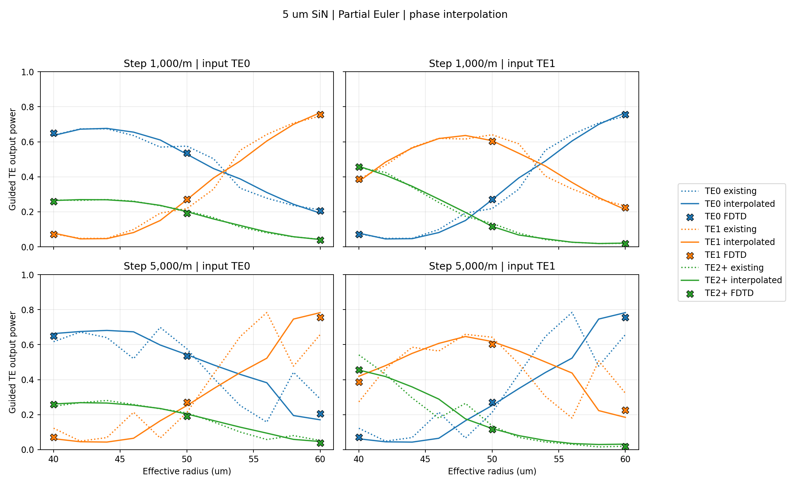
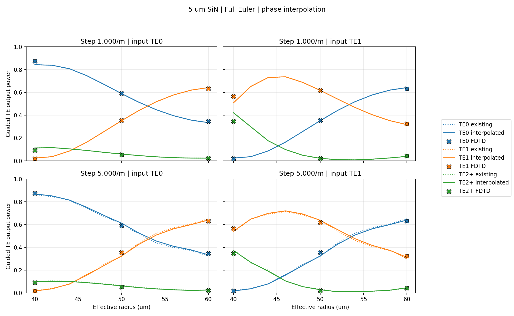

SiN Euler-bend curvature interpolation example
==============================================

This example compares the existing EME phase calculation with optional
``neff_interpolation=True`` for two distinct 5 µm wide SiN bends: **Partial
Euler** and **Full Euler**. The SiN core is 300 nm thick, the wavelength is
1.55 µm, and only curvature varies along each bend. The two precomputed
sample datasets have curvature steps of 1,000 and 5,000 m⁻¹ from 0 to
50,000 m⁻¹. Load them from ``sample_datasets/w_5um_curv_01000pm`` and
``sample_datasets/w_5um_curv_05000pm`` with ``is_testmode=True``.

The `reproducible Python example
<https://github.com/thdwotjd/dataset-based-eme/blob/main/examples/SiN_curvature_interpolation.py>`_
constructs a 90-degree centerline with effective radii from 40 to 60 µm in
2 µm increments. It uses the same Euler profile construction as the earlier
FDTD curvature convergence study. The simulation keeps
``EMEStabilityConfig()`` at its defaults and changes only the phase
interpolation option. The sample datasets already contain effective indices
and overlaps; the example does not start an FDE or FDTD calculation.

Run from the repository root, with one dataset per Python process::

   python examples/SiN_curvature_interpolation.py --step 1000
   python examples/SiN_curvature_interpolation.py --step 5000
   python examples/SiN_curvature_interpolation.py --plot-only

The plots show a **linear 0–1 output-power axis**. Each row is one dataset
step, and each column is one input mode (TE0 or TE1). Colors identify the
output groups TE0, TE1, and TE2+ (the sum of higher guided TE modes). Solid
lines use interpolated phase, dotted lines use the existing phase, and crosses
are archived FDTD values at effective radii 40, 50, and 60 µm. Other radii
have no FDTD reference.

Partial Euler
-------------

Full Euler
----------

FDTD comparison
---------------

The table shows mean absolute deviation from FDTD in **percentage points**.
Each entry averages 18 comparisons: three reference radii, two input modes,
and three guided output groups. These values come from the integrated
``sim.EME(..., neff_interpolation=True)`` path, not a manual phase override.

.. list-table:: Mean absolute FDTD error (percentage points)
   :header-rows: 1
   :widths: 25 20 25 30

   * - Bend
     - Curvature step
     - Existing phase
     - Interpolated phase
   * - Partial Euler
     - 1,000 m⁻¹
     - 1.594
     - 0.703
   * - Partial Euler
     - 5,000 m⁻¹
     - 5.423
     - 1.648
   * - Full Euler
     - 1,000 m⁻¹
     - 1.414
     - 1.402
   * - Full Euler
     - 5,000 m⁻¹
     - 1.636
     - 1.230

The 5,000 m⁻¹ dataset improves substantially for Partial Euler and more
modestly for Full Euler in this comparison. The 1,000 m⁻¹ Full Euler result
changes very little. This is a case-specific validation of phase
interpolation; it does not establish that every coarse dataset is converged
or that interpolation improves every structure. In particular, fields and
interface overlaps are still taken from the discrete dataset.

The `archived FDTD reference CSV
<https://github.com/thdwotjd/dataset-based-eme/blob/main/examples/data/SiN_w5_curvature_fdtd_reference.csv>`_,
`DREME result CSVs and figures
<https://github.com/thdwotjd/dataset-based-eme/tree/main/examples/results/sin_curvature_interpolation>`_,
and the script are included for inspection and rerunning.
